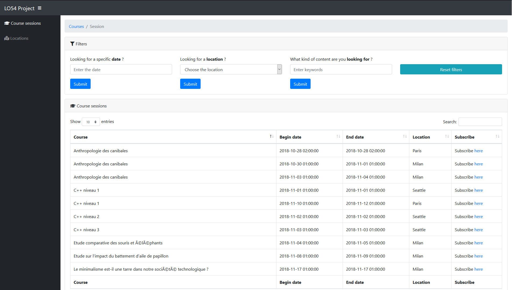
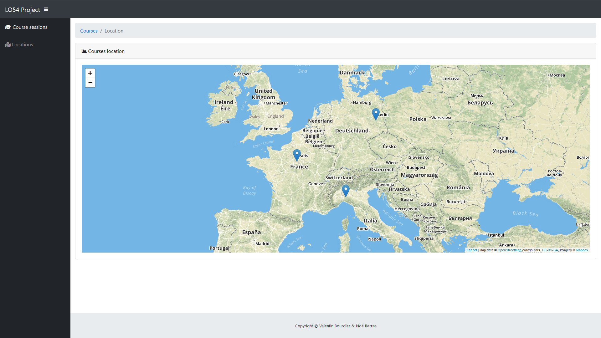
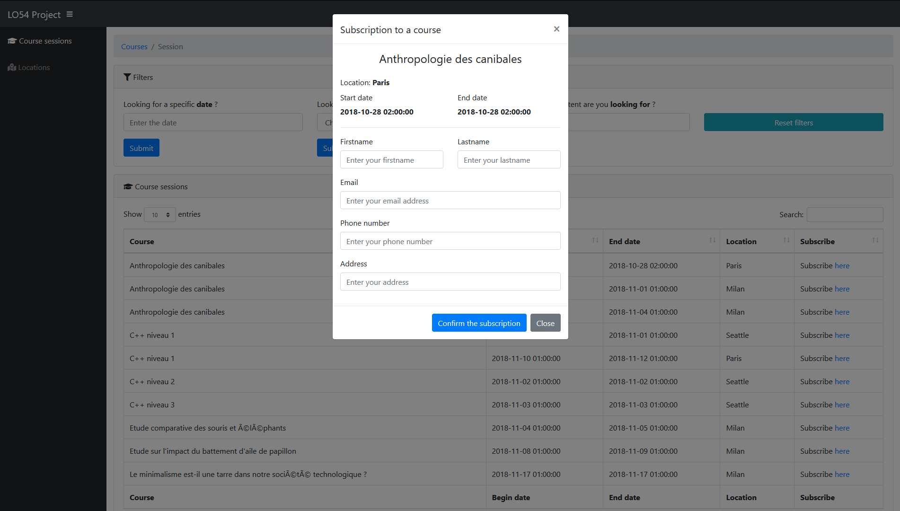

# LO54-project

## Prerequisits

### Database

To **set-up the database**, you got **3 choices**, in the following sessions.

It will:
- **create** the database schema, and the tables associated
- **populate** the database with some fake values

#### Ever existing MySQL / MariaDB database

If you ever got, on your computer, an **MariaDB or MySQL database set-up**, you can simply execute the SQL scripts located in the [database/scripts](database/scripts/) directory

For an **out of the box working experience**, you need to **configure** the following parameters :
- **Server host**: localhost
- **Server port**: 3306
- **Database username**: root
- **Database password**: root

If any of those **parameters are different**, you will need to modify the following files concording to your configuration :
- [hibernate.cfg.xml](app/lo54-project/src/main/resources/hibernate.cfg.xml)
- [persistence.xml](app/lo54-project/src/main/resources/META-INF/persistence.xml)

#### Using Docker

In the [database](database/) directory, there is a [docker-compose.yml](database/docker-compose.yml) file, that will build a custom Docker image based on MariaDB.

To launch it, just do :

```bash
# Go into the database directory
cd database

# Launch the server
sudo docker-compose up -d
```

#### Using Vagrant

If you are on **Windows**, it will probably be **easier** than installing Docker to use (Vagrant)[https://www.vagrantup.com/].

To use it, you need to **install** latest version of :
- [VirtualBox](https://www.virtualbox.org)
- [Vagrant](https://www.vagrantup.com/)

Once done, type :

```bash
# Go into the database directory, where is located the Vagrantfile
cd database

# Launch the VM and install the MySQL server
vagrant up
```

It will :
- Create a virtual machine based on [Ubuntu 18.04](http://releases.ubuntu.com/18.04/)
- Install Docker and all of it's prerequisits
- Launch the MariaDB server

#### Additional informations

If you are using **Docker** or **Vagrant** from the previous step, two things will be configured :
- The database, [MariaDB](https://mariadb.org/), which is a fork of [MySQL](https://www.mysql.com/)
- [Adminer](https://www.adminer.org/), an equivalent of [phpMyAdmin](https://www.phpmyadmin.net/), to interact with the database through a web interface

Here is the **connection configuration for MariaDB**:

| Host      | Port | Username | Password | Database |
|-----------|------|----------|----------|----------|
| localhost | 3306 | root     | root     | LO54     |

Here is the **connection configuration for Adminer**:

| Host      | Port | Username         | Password         | Database         | Url                    |
|-----------|------|------------------|------------------|------------------|------------------------|
| localhost | 8081 | Same as database | Same as database | Same as database | http://localhost:8081/ |


### IDE

You could use any IDE as you like, but as this project was developped with the **Netbeans** of the LO54 course, it is **higly recommended** for you to use the same.


## Start the project


Once the **project is imported** into your IDE, you will need to:
- Download the **Maven dependencies**
- **Build** the web application
- **Launch it**

> No extra configuration is required !


## Screenshot


### Home page



### Locations page




### Subscription page

